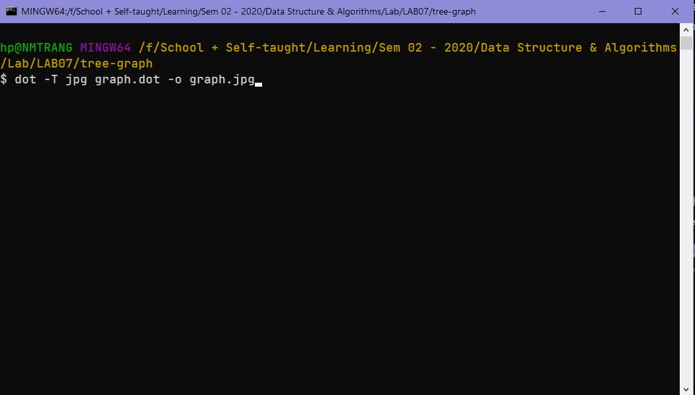
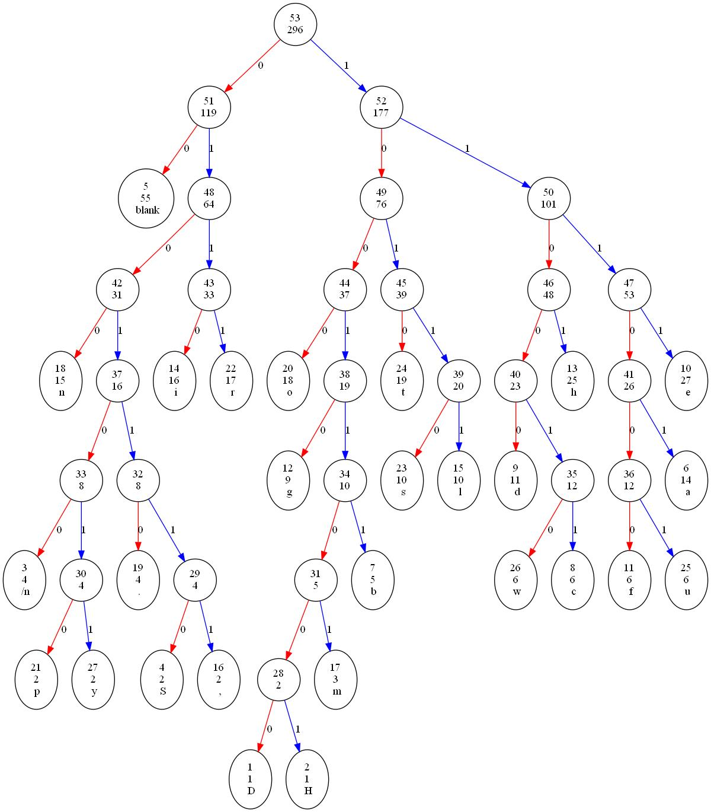

# PLEASE READ THIS TO MAKE SURE ALL THE DEPENDENCIES ARE AVAILABLE

Name: Nguyen Minh Trang 

ID: ITDSIU19020

Since it is hard to visualize the huffman tree without using any library, I did research on this and found out Graphviz software that can handle the drawing part.

Make sure to download <a link="https://graphviz.org/download/">Graphviz</a>. 

<b>Note</b>: create PATH for Graphviz too

The main Java code will automatically write the <b>graph.dot</b> which is crucial for Graphviz to process information about the graph and to export to desired format.

# How to draw the Huffman Tree?
Use Bash to navigate to the folder that contains the <i>input.txt</i> and the <i>graph.dot</i> file. In this case, folder tree-graph.

Next, type this command to export the jpg image file:

<i>dot -T jpg graph.dot -o graph.jpg</i>

<h3>The Huffman graph has just been created</h3>
<h5>Text: "I'm Nguyen Minh Trang. I am working on DSA lab"</h5>

<b>Interpretation</b>: Upper number is the node number. Lower number is the occurrence number. Last is the character. Therefore, according to the text, there are 47 characters that constitute 53 nodes.

# REFERENCES
<a link="https://eli.thegreenplace.net/2009/11/23/visualizing-binary-trees-with-graphviz">Visualizing binary trees wit Graphviz</a>

<a link="https://www.graphviz.org/documentation/">Graphviz Documentation</a>

<a link="http://homes.sice.indiana.edu/yye/lab/teaching/spring2014-C343/huffman.php">Huffman Coding</a>

<a link="https://www.techiedelight.com/huffman-coding/">Huffman Coding Compression Algorithm</a>
